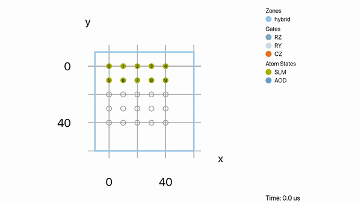

```{code-cell} ipython3
:tags: [remove-cell]
%config InlineBackend.figure_formats = ['svg']
```

<style>.widget-subarea{display:none;} /*hide widgets as they do not work with sphinx*/</style>

# Hybrid Neutral Atom Routing and Mapping

Neutral-atom (NA) processors combine long-range, native multi-qubit interactions with high-fidelity atom transport.
HyRoNA, the hybrid mapper in MQT QMAP, exploits both capabilities: it adaptively mixes gate-based routing (SWAP/BRIDGE)
with atom transport to minimize latency and error. It pairs interaction-aware initial placement with fast,
capability-specific cost models and an ASAP scheduler that respects hardware constraints, and it emits hardware-native
programs plus optional animation files for visualization.

Below, we show how to use the Hybrid NA Mapper from Python on a small GHZ example and how to tune a few key parameters.

## Example: GHZ state on a hybrid NA architecture

In this example, we prepare an 8-qubit GHZ state (similar to the [zoned compiler](na_zoned_compiler.md)) and map it to a hybrid NA architecture.

```{code-cell} ipython3

from qiskit import QuantumCircuit
# Build a compact GHZ(8) circuit (tree-like to keep depth small)

qc = QuantumCircuit(8)
qc.h(0)
qc.cx(0, 4)
qc.cx(0, 2)
qc.cx(4, 6)
qc.cx(0, 1)
qc.cx(2, 3)
qc.cx(4, 5)
qc.cx(6, 7)

qc.draw(output="mpl")

```

### Load a hybrid NA architecture

The hybrid mapper expects an architecture specification in JSON.
This repository ships several ready-to-use examples.

```{code-cell} ipython3

from pathlib import Path
import tempfile
import os
from mqt.qmap.hybrid_mapper import NeutralAtomHybridArchitecture

# Create a minimal architecture from an in-code JSON string and instantiate
# the NeutralAtomHybridArchitecture using a temporary file. The mapper's
# constructor expects a filename, so we write the JSON to a temp file first.
arch_json = '''{
  "name": "example arch",
  "properties": {
    "nRows": 5,
    "nColumns": 5,
    "nAods": 1,
    "nAodCoordinates": 1,
    "interQubitDistance": 10,
    "minimalAodDistance": 0.1,
    "interactionRadius": 1,
    "blockingFactor": 1
  },
  "parameters": {
    "nQubits": 10,
    "gateTimes": {
      "none": 0.5
    },
    "gateAverageFidelities": {
      "none": 0.999
    },
    "decoherenceTimes": {
      "t1": 100000000,
      "t2": 1500000
    },
    "shuttlingTimes": {
      "move": 0.55,
      "aod_move": 0.55,
      "aod_activate": 20,
      "aod_deactivate": 20
    },
    "shuttlingAverageFidelities": {
      "move": 1,
      "aod_move": 1,
      "aod_activate": 1,
      "aod_deactivate": 1
    }
  }
}'''

with tempfile.NamedTemporaryFile(mode="w", delete=False, suffix=".json") as _tmp:
    _tmp.write(arch_json)
    tmp_name = _tmp.name

arch = NeutralAtomHybridArchitecture(tmp_name)
# Clean up the temporary file
os.unlink(tmp_name)

print(f"Loaded architecture: {arch.name} with {arch.num_qubits} qubits.")

```

### Map with HyRoNA

Mapping translates the algorithm to hardware-native operations using a combination of routing with SWAP/BRIDGE gates and
atom moves. What combination is used depends on the architecture capabilities and the mapper parameters.
Here, we show two examples: first, we only use gate-based routing, then we let the mapper decide freely.

```{code-cell} ipython3
from mqt.core import load
from mqt.qmap.hybrid_mapper import HybridNAMapper, MapperParameters

# Optional: tweak parameters (defaults are sensible for most cases)
params_shuttling = MapperParameters()
params_shuttling.gate_weight = 1.0
params_shuttling.shuttling_weight = 0.0  # disables atom moves


mapper = HybridNAMapper(arch, params=params_shuttling)

# Convert the Qiskit circuit to an MQT QuantumComputation and map it
circ = load(qc)
mapper.map(circ)  # optionally: mapper.map(circ, initial_mapping=InitialCircuitMapping.identity)

# Retrieve mapping statistics
mapper.get_stats()
```

Note, how we set `shuttling_weight` zero to disallow atom moves and only use SWAP gates for routing.

The idea of the hybrid mapper is to mix both capabilities or to automatically select the best one.
We now re-run the mapping with default parameters that allow both SWAPs and atom moves.

```{code-cell} ipython3
params_default = MapperParameters()

mapper.set_parameters(params_default)

mapper.map(circ)
mapper.get_stats()
```

Now the mapper uses atom moves only as they are the better option on this architecture where moves are unit fidelity and
gates are noisy.

### Schedule the mapped circuit

Scheduling orders the mapped operations as-soon-as-possible while respecting hardware constraints.

```{code-cell} ipython3
# Schedule; set create_animation_csv=True to generate visualization data
results = mapper.schedule(verbose=False, create_animation_csv=False)

results
```

You can retrieve the mapped scheduled circuit (extended QASM2) and, if desired, the variant with explicit AOD movements equivalent to the operations done on the hardware.

```{code-cell} ipython3

mapped_qasm = mapper.get_mapped_qc_qasm()
# Print a snippet of the mapped QASM
print("\n... Mapped QASM snippet ...\n" +
    "\n".join(mapped_qasm.splitlines()[:30]))

# AOD-annotated variant (hardware-native moves)
mapped_aod_qasm = mapper.get_mapped_qc_aod_qasm()
print("\n... AOD (converted) snippet ...\n" + "\n".join(mapped_aod_qasm.splitlines()[:30]) + "\n...")
```

Here, the `q` register corresponds to the 5x5=25 coordinates of the architecture and no longer to the circuit qubits.
The other registers are used for temporary storage and AOD control.

The second variant shows explicit AOD movements that correspond to the atom moves done on hardware.
Here, the AODs can be activated, moved, and deactivated to shuttle atoms around.
The first entry corresponds to the x-direction and the second to the y-direction; in each pair, the two numbers denote start and end coordinates.

### Export animation files (optional)

HyRoNA can write animation output files that can be visualized with [MQT NAViz](https://github.com/munich-quantum-toolkit/naviz).
Typically one has to accelerate the shuttling speed for better visualization by setting `shuttling_speed_factor`.

```{code-cell} ipython3
# Re-run scheduling with animation output enabled
_ = mapper.schedule(verbose=False, create_animation_csv=True, shuttling_speed_factor=100)

# Save the files; the method writes `.naviz` and `.namachine` files
# next to the given base name
mapper.save_animation_files("ghz8_hyrona_animation")
```

This creates `.namachine` and `.naviz` files which can then be imported into
MQT NAViz for visualization.



## Tuning the mapper

HyRoNA exposes a concise set of parameters via `MapperParameters`:

- lookahead_depth: limited lookahead to peek at near-future layers
- lookahead_weight_swaps / lookahead_weight_moves: balance gate-routing vs. atom motion during lookahead
- decay: decreases the incentive for repeatedly blocking the same qubits
- gate_weight / shuttling_weight / shuttling_time_weight: cost-model weights for gates vs. transport
- dynamic_mapping_weight: bias for enabling dynamic re-mapping (SWAP/MOVE) when beneficial
- max_bridge_distance: limit for BRIDGE operations; use to avoid long-range chains
- initial_coord_mapping: strategy for hardware coordinate initialization

For more details, please check the source code documentation of `MapperParameters`.

## Tips

- Initial mapping: you can explicitly select the initial circuit-to-hardware mapping for `map` or `map_qasm_file` using
  `initial_mapping=InitialCircuitMapping.identity` or `InitialCircuitMapping.graph`.

- QASM input: instead of building a circuit in Qiskit, you can call `mapper.map_qasm_file("path/to/circuit.qasm")` and
  then `mapper.schedule(...)` as shown above.

- Architectures: the examples `rubidium_hybrid.json`, `rubidium_gate.json`, and `rubidium_shuttling.json` in
  `architectures/` cover different capability profiles and are a good starting point

## Hybrid Synthesis Mapper

The Hybrid Synthesis Mapper helps you compare and stitch together alternative circuit fragments while keeping track of the current mapping on the NA device.
Below is a compact example that mirrors the unit test flow and shows how to:

- evaluate multiple candidate fragments and pick the best,
- append fragments,
- and retrieve mapped QASM as well as the AOD-annotated variant.

First, we create the `HybridSynthesisMapper` and evaluate two candidate fragments (here, both are the same GHZ circuit as above for simplicity).

```{code-cell} ipython3
from mqt.qmap.hybrid_mapper import HybridSynthesisMapper

# Reuse the architecture `arch` and GHZ circuit `qc` defined above.
synth = HybridSynthesisMapper(arch)
synth.init_mapping(qc.num_qubits)

fidelities = synth.evaluate_synthesis_steps([circ, circ], also_map = False)
print("Fidelities of subcircuits:", fidelities )
```

The fidelity return indicates how well the subcircuit can be appended to the circuit mapped to the hardware.

You can then build up a larger program by appending fragments.

```{code-cell} ipython3
synth.append_with_mapping(circ)
```

This appends the circuit and maps it directly. This can be repeated for multiple fragments to always choose the best one.

Similar to the normal Hybrid Mapper, you can retrieve the mapped circuit and the AOD-annotated variant:

```{code-cell} ipython3

# Retrieve mapped circuit (extended QASM2)
qasm_mapped = synth.get_mapped_qc_qasm()
print("\n... Mapped QASM snippet ...\n" +
    "\n".join(qasm_mapped.splitlines()[:30]) +
    "\n...")
```

One can also access the circuits which is constructed step-by-step in a unmapped state (e.g. to use a different mapper).

```{code-cell} ipython3
qasm_synth = synth.get_synthesized_qc_qasm()
print("\n... Synthesized QASM snippet ...\n" +
    "\n".join(qasm_synth.splitlines()[:30]) +
    "\n...")
```

Here this corresponds simply to the input GHZ circuit.

This workflow lets you mix candidate-generation (synthesis) with hardware-aware mapping and scheduling, while keeping a single source of truth for mapping state across fragments.
